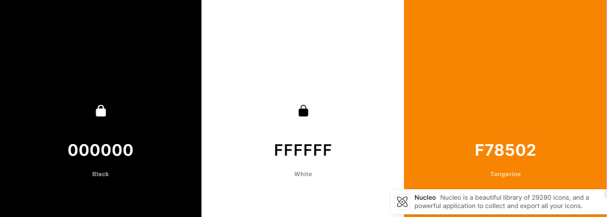
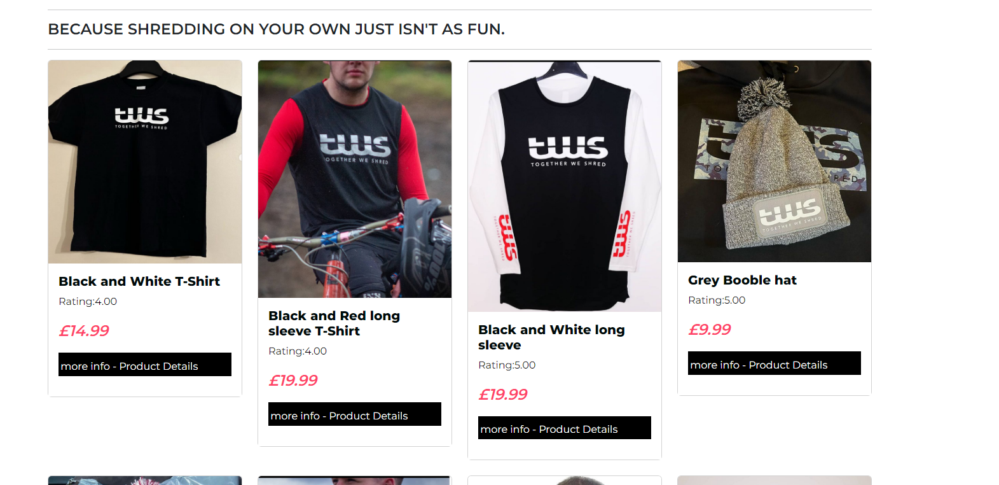

# TWS -Together we Shred

## Link to Live Site
[Visit Live Site](http://tws.herokuapp.com/) - hosted on Heroku, ElephantSQL and AWS.
## Design Brief
The site was created to support my nephews (will refer to as TWS Owner)  new business - TWS (Together we Shred). It is a lifestyle clothing brand aimed at the motocross and mountain biking community. The range of clothing is designed to be comfortable, practicable, of a high quality but also have an image that represents the customers in the motocross and mountain biking community, and make people want to but the brand based on its image.  He is very much trying to create a brand, the shared love of getting out and riding together and sharing those experiences.The company is active on Instagram and Facebook however lacks an ecommerce presence. 

## Early Challenge Identified as part of brief
Ensuring that the ecommerce site reflects the brand, shows that I have developed this myself, and can demonstrate my skills and not just follow the boutique_ado site, and make small amendments.  I did question if I should do a different site but it was important to me to try and deliver an ecommerce site that could with some minor work be used in the real world, and was a real use case. 

# Strategy Plane - UX
## Project Goals 
Together We Shred is a full stack e-commerce website built using Django, Python, HTML, CSS and JavaScript. The website uses Stripe as the payment processor.
It was developed for my final assignment to showcase the skills I have learnt during the Code Institute Level 5 Diploma course.
The ecommerce site, had to meet, and represent the brand, be of high quality and have potential to be used to help improve TWS Owners business and increase ability to generate income. 

## Audience

* Guest - aimed at riders of Mountain bikes, Motocross riders, and the supporters in that area who are looking for a clothing brand.
* Registered USers -returning vistors to the site who regularly purchase and are interested in exclusive discounts
* Admin - admins being able to add, update prodcuts to shop with an easy interface.

## Why ?
The site was created to support my nephews new business - TWS (Together we Shred). I hoped it could help generate an income for him with, and with some further devleopment be a valuable part of his business.

# Scope Plane - UX
I have tried to plan the site, from a user perspective and administrative perspective. 
This will then lead me to design my Database Schema, allow me to identify priorities for the project from a TWS Owner , Administrator of site and customer perspective.

Priorities and requirements may change later on, to ensure I meet the criteria of the Assignment as well as TWS Owners  requirements. 

Importance 1 - 5 with    
1 being nice to have 
5 being essential

To enable me to develop a MVP, Focus of user stories was those with a priority of 4 and 5, I also added the User Story ID 11 even though a priority of 3, to satisfy the need for additional unique models as part of the course requirements.

| ID | Process          | As A/An  | I Need To Be Able To                              | So That I Can                                                                                       | Importance |
|----|------------------|----------|---------------------------------------------------|-----------------------------------------------------------------------------------------------------|------------|
| 1  | Site             | Customer | Understand purpose of site quickly and clearly    | Decide if I am on the correct site and suits my needs                                               | 5          |
| 2  | Product          | Customer | Browse the site easily                            | Find products quickly and easily                                                                    | 5          |
| 3  | Product          | Customer | Filter Products                                   | Find products based on category i.e hoodies, hats.                                                  | 3          |
| 4  | Product detail   | Customer | View detailed information about specific products | So I can see more details about the product, and a larger more detailed image.                      | 5          |
| 5  | Purchase         | Customer | Add Items to shopping bag                         | Store these for purchase                                                                            | 5          |
| 6  | Purchase         | Customer | Increase and decrease quantities easily           | So that I can quickly purchase more of the same item, or reduce the number of items                 | 5          |
| 7  | Purchase         | Customer | See total of items in shopping bag                | Identify how much I am currently spending                                                           | 4          |
| 8  | Purchase         | Customer | Remove items from shopping bag                    | In case I decide I no longer want these items                                                       | 4          |
| 9  | Checkout/Payment | Customer | Items purchasing, and total amount to pay         | Checkout quickly and easily                                                                         | 5          |
| 10 | Checkout/Payment | Customer | Pay for items securely                            | Have confidence that my order, and money is processed safely.                                       | 5          |
| 11 | Checkout/Payment | Customer | Add a voucher code                                | So that I can apply a discount to my order                                                          | 3          |
| 12 | Checkout/Payment | Customer | Receive payment and order on-screen feedback      | Confident that payment has been processed and order is being processed                              | 4          |
| 13 | Checkout/Payment | Customer | Receive confirmation email                        | Confident of items ordered, amount paid and have contact details of the company in case of queries. | 4          |
| 14 | User Profile     | Customer | Register for an Account                           | So I can store my address details                                                                   | 5          |
| 15 | User Profile     | Customer | Login / Logout                                    | Keep my personal information secure                                                                 | 5          |
| 16 | User Profile     | Customer | View My Profile                                   | View details I have stored with the site                                                            | 5          |
| 17 | User Profile     | Customer | Edit My Profile                                   | I can update my address, for example                                                                | 5          |
| 18 | User Profile     | Customer | Login with Social media account                   | So I can be quickly and easily registered with the site                                             | 2          |
| 19 | Product Admin    | Admin    | Show/Highlight Popular Items                      | To tempt people into buying these items                                                             | 2          |
| 20 | Product Admin    | Admin    | Add Products                                      | Add new products to the website quickly and easily for customers to view                            | 5          |
| 21 | Product Admin    | Admin    | Edit Products                                     | Edit details of existing products, for example if other colours become available, or price changes. | 5          |
| 22 | Product Admin    | Admin    | Delete Products                                   | Remove products that no longer sell                                                                 | 5          |
| 23 | Marketing        | Admin    | Send promotional emails                           | To encourage customers to purchase and shop with us                                                 | 3          |
| 24 | Marketing        | Admin    | Understand shopping trends                        | So the brand can move with the times and produce more of the products customers want                | 3          |

# Structure Plane - UX
Below is a structure of the site I decided to use a swimlane approach, helped me identify areas of site that needed to be built first, and how the different functions for different users build on each other.

## DB schema
Below is the intial mapping out of the Database structure, based on the requirements identified. This was done to help me visualise how they interlink and primarark and foreign keys needed. It would also give me an opportunity to review and make future improvements. Some fields were added and not used, this was becuase my focus was on prpdcuing a Minimal Viable prpdcut to satisfy the course requirements, rather than a perfect solution at the 1st attempt. I felt including the fields would help me make these improvements quicker later on. 

# Skeleton Plane - UX
## Handrawn
I roughly drew out the layout, and what i felt the site would look like, some images below.

## wireframes
I created some inital wireframes for the main areas of the site, and would use these as a basis for the rest of my site.

# Surface Plane - UX

## Design Inspiration
TWS Owner provided several websites that they like the look off, however the website www.24mx.co.uk was a site that the layout was most simliar to what they had visualised. It was clean and fresh.The TWS logo was already a black and white image, which represented the brand perfectly, and was main basis for the colour scheme,with splashes of colour to focus user for any Call to actions.

## Bootstrap 4
Bootstrap 4 was used for the front-end for faster and easier web development, it ocntained feature that matched the disired outcomes such as the Grid system, Bootstrap also gives you the ability to easily create responsive designs, hower this can come at some compromises.

## Colour scheme
TWS logo was black and white, and this was very much the brand, and fitted the target audience.

## Typography
The font used was Montserrat, it is a very clean font, and with the use of weights was able to emphasis areas on the website.

# Features

## Header
The header contains the company logo for tws and this is the most important aspect, so visitors to the site see th ebrand straight away.
I have included the shopping cart and when images are added or removed the item total increases or decreases

## Navigation
The navigation contains links ot the main areas of the site, the login, signup buttons adjust dependendant on if you are a guest
### Guest user

### registered user
Have the ability to create a profile and update their address details, to improve the checkout process. We will also register there detials and use this to send out unique discount codes, special offers.

## admin user 
Admin users are able to manage aspects of the website, with CRUD fucntionality for the products database.

## Home Page 
The home page is to be visually attractive, look proffesional, meet TWS owners deisgn requirements. Be easy to use and to highlight key areas of the website with CTA.

## Online Shop

### Shop Landing screen
At present the TWS owner only has 8 products for sale, so aspects like filtering and sorting and search seemed unecessary at this stage.
These will be added as required. The shop is designed to show a quick preview of the product and its price, without bombarding the user with loads of information.Its designed to be a shop front.

### Product detail page
A user can then click and view more details about the product, add the required quantities to the shopping bag.

## Shopping bag
Users are able to see the items in the shopping bag, increase, decrease or remove items. They also have the ability to apply any discount codes they may have before they proceed to the checkout. 

## Shopping bag - discount applied
If a user applies a discount code, the shoppingn bag will adjust to show the total prior to the discount,the % percentage applied and code used. 

## Checkout
Free shipping is applied on orders over £100, otherwise a standard £3.99 shipping fee applies. If a discoutn code is used the calculation of free shipping is 
applied based on discounted total. The checkout process will autocomplete the contact and delivery details for qa user with a profile created. Payment will be processed by Stripe.

## Registered Users
Users with a profile created, are able to checkout quicker, and viewsummary details of previous orders, more importantly the order number in case they have queries.

## Footer
Footer is clean and simple with links to social media - Instagram and Facebook.

## Manage Shop (CRUD)
A front end for adminstrators was added to make the management of the shop easier, and to provide the TWS owner with a more appealing GUI, that they could easily navigate and understand.

### Add Product(s) 

### Edit Product details

## Get in Touch
A user can contact us this is then stored in a DB, future development will include when and who actioned, along with a front end to manage these queries.
It was felt this is an easier way to manage messages coming into the site.

# Testing
This was a continual process throughout the develop,ment of the site, I checked after every commit functionilty of the element I havd just updated, and made sure had no impact on other areas of the site. I have also listed below key milestone type testgn that was carried out, such as user stories and validation.

## Testing against user stories
I walked thorugh the user stories to ensure the finished product met all of the requirments. 
| ID | OUTCOME                                                                                                              | As A/An  | I need to be able to.                             | So that I can                                                                                       |
| -- | -------------------------------------------------------------------------------------------------------------------- | -------- | ------------------------------------------------- | --------------------------------------------------------------------------------------------------- |
| 1  | PASS - design is clear and easy to navigate and clearly prompts the brand                                            | Customer | Understand purpose of site quickly and clearly    | Decide if i am on the correct site and suits my needs                                               |
| 2  | PASS - navigating the site is easy, and as products expand, filtering and sorting will be added.                     | Customer | Browse the site easily                            | Find products quickly and easily                                                                    |
| 4  | PASS - products details are shown and are clear and easy to understand                                               | Customer | View detailed information about specific products | So I can see more details about the product, and a larger more detailed image.                      |
| 5  | PASS - users of the site can easily add items to the bag                                                             | Customer | Add Items to shopping bag                         | Store these for purchase                                                                            |
| 6  | PASS - users can easily adjust the quantities of items                                                               | Customer | Increase and decrease quantities easily           | So that i can quickly purchase more of same item, or reduce number of items                         |
| 7  | PASS - users can easily see how much they are spending                                                               | Customer | See total of items in shopping bag                | Identify how much i am currently spending                                                           |
| 8  | PASS  - users can easily remove items from the shopping bag                                                          | Customer | Remove items from shopping bag                    | In case decide no longer want these items                                                           |
| 9  | PASS - user can easily checkout                                                                                      | Customer | Items purchasing, and total amount to pay         | Checkout quickly and easily                                                                         |
| 10 | PASS - users have confirmation on screen order has been received, and is logged against profile for registered users | Customer | Pay for items securely                            | Have confidence that my order, and money is processed safely.                                       |
| 11 | PASS customer can apply a valid discount code                                                                        | Customer | Add a voucher code                                | So that I can apply discount to my order                                                            |
| 12 | PASS - users have confirmation on screen order has been received, and is logged against profile for registered users | Customer | Receive payment and order on screen feedback      | Confident that payment has been processed and order is being processed                              |
| 14 | Pass - user can create a prpfile for storing details                                                                                                        | Customer | Register for an Account                           | So i can store my address details                                                                   |
| 15 | PASS User user can login and out                                                                                                         | Customer | Login /Logout                                     | Keep my personal information secure                                                                 |
| 16 | PASS - users can register and create a profile to store delivery information                                         | Customer | View My Profile                                   | View details I have stored with site                                                                |
| 17 | PASS - users can edit their profile                                                                                  | Customer | Edit My Profile                                   | I can update my address for example                                                                 |
| 20 | PASS - Administrators of the site can add products                                                                   | Admin    | Add Products                                      | Add new products to the website quickly and easily for customers to view                            |
| 21 | PASS - Administrators of the site can edit products                                                                  |          | Edit Products                                     | Edit details of existing products, for example if other colours become available, or price changes. |
| 22 | PASS - Administrators of the site can delete products                                                                | Admin    | Delete Products                                   | Remove products that no longer sell                                                                 |

## CSS, ,JS, Python test
Google Lighthouse via developer tools, W3C Markup Validator, JSHint and the Lighthouse report were used to determine whether there were any errors in the code. I ensured standards were met in design, and also ensure accessebility standards were met.

Any errors identified were an accepted compromise, particualry with CSS and the use of Boostrap

## Lighthouse
The site was run using the Google chrome lighthouse devleoper tool, to ensure it met accessebility standards and scored a minimum of 90

## Flake 8
Flake 8 was used to check the syntax, and ensure correct formatting of my Python code.
## Screen size testing
Testing was carried out to ensure deisgn was repsoonsove and where needed media querys were added.

common breakpoints used for widths of devices:
* 320px — 480px: Mobile devices
* 481px — 768px: iPads, Tablets
* 769px — 1024px: Small screens, laptops
as per - https://www.freecodecamp.org/news/css-media-queries-breakpoints-media-types-standard-resolutions-and-more/

## issues
Below I have listed some of the issue I encountered and the resolution during my development

### Published Stripe Secret Key 18/3/23
Resolved: Within stripe expired the current key, created a new key and updated the environment variables.

### Processing Payment with Stripe:
Invalid value for stripe.confirmCardPayment intent secret: value should be a client secret of the form ${id}_secret_${secret}. You specified:

Resolved: I was using the Environment variable client_secret_key, instead of the secret_key that gets created when a PaymentIntent with stripe is created.

### Processing Payment with Stripe:
Stripe: Uncaught (in promise) TypeError: form.submit is not a function
Submit button id in checkout.html  was different to the one in stripe_elements.js

### Broke Site and unsure why
I hadn’t committed the changes,so out of sequence. Used git restore to restore shoppingbag/contexts.py and discountcodes/views.py to recover to my last commit on these pages. 

local variable 'intent' referenced before assignment
Added the code - print(order_form.errors.as_data()) into checkout/views.py for troubleshooting within:
else:
            messages.error(request, 'There was an error with your form. \
                Please double check your information.')
            print(order_form.errors.as_data())    
In console with line above shows 
{'country': [ValidationError(['This field is required.'])]}
 Updated checkout/forms.py to include the country field 

### SuspiciousOperation at /checkout/ on Heroku deployed site
Attempted access to '/checkout/js/stripe_elements.js' denied.
AWS related - 
Leading forward slash caused my issue thanks to code institute tutor support

# Version Control
## Gitpod/Github
Version control was achieved,by pushing any changes from local development environmnet gitpod, to Github, with regular and meaningful commit messages.
* git add . to add all work to git
* git add "specific filename" - can be used to add only a specific file, I personally used git add . 
* git commit -m "% enter a meaningful message %" - to commit/save the changes
* git push - to push them up to GitHub

# Live Deployment
Gipod and the SQlLite Db isnt available for live deployments so we used.
* Heroku - Deployed Site
* ElephantSQl - Deployed DB
* AWS - Hosting images, and static content.

## ElephantSQL
1. Create an Account with [Elephant SQL](https://www.elephantsql.com/)
2. Create New Instance
3. Name your database
4. Select Plan "TinyTurtle Free"
5. Select Region "EU-West-1(Ireland)"
6. Review and Create Instance
7. copy url for your DB (need this for Heroku)

## Heroku
1. Create an Account with [Heroku](https://dashboard.heroku.com)
2. Create a New App
3. Select clostest region
4. Create app
5. Create Config variable for the DB_URl (copy and pasted earlier from ElephantSQL)

## Gitpod preperation
Preparation for linking gitpod, github, heroku and elephantsql when committing future changes.
1. pip3 install dj_database_url==0.5.0
2. pip3 install psycopg2
3. pip3 freeze > requirments.txt
4. settings.py import dj_database_url
5. settings.py add comment out existing DB , and add in the ElephantSQl url - used to create intial DB
6. python3 manage.py runserver to see we are connecting to the Live DB
7. python3 manage.py migrate (created LiveDB)
8. python3 manage.py createsuperuser -so we can access the new Live DB
9. settings.py upage the DB section to include an IF statement for development DB or Live DB, using the environmnet variable created earlier in Heroku
10. pip3 install gunicorn - will be our webserver
11. pip3 freeze > requirments.txt
12. Create a Procfile at root - web: gunicorn twsshop.wsgi:application
13. settings.py add the heroku url to "Allowed_Hosts"
14. git add. 
15. git commit -m "Useful Message"
16. git push

## Heroku
Enable git to push changes to live site
1. In Heroku Dpeloy select GitHub
2. Search for repository and link
3. select enable automatic deployments

### in gitpod
1. git push heroku master
### Heroku
1. check under the activity tab if you can see a build being created.
now when you push changes this will go the the local and live environments.

### Security Changes
1. Set an Enviromnet variable for Debug - so debug only shows when in local environment
2. Geneerate an new secret key for Django and the live environment variable in Heroku

## Amazon Web Services

1. Create a Free Tier Account at [Amazon AWS](https://aws.amazon.com/) 
2. select or Search for S3
3. Create a new bucket
4. Enable static web hosting on the bucket created
5. Copy the ARN (Amazon Resource Name) - will need this in a bit
6. Click permissions tab
7. Edit Bucket Policy using Policy Generator
8. Type of Policy - S3 Bucket Policy
9. Principal - *
10. Actions - GetObject
11. ARN - Paste in from earlier
12. add /* at the end of the url in Resource 

### Updating the CORS Configuration
[
    {
        "AllowedHeaders": [
            "Authorization"
        ],
        "AllowedMethods": [
            "GET"
        ],
        "AllowedOrigins": [
            "*"
        ],
        "ExposeHeaders": []
    }
]

### Enable Public Access
Edit Access Control List(ACL) enable public access
Select to say you accept the wanring

### Amazon AWS User and Groups
1. Search for IAM
2. Create a Group
3. Create a Policy using import managed policy import
4. Select "AmazonS3FullAccess"
5. Create Policy
6. Attach policy to the group
7. Create a user
8. Add the user to the group
9. Save the user access key, and the secret key

## Linking Amazon AWS and Django

### Gitpod
1. pip3 install boto3
2. pip3 install django-storages
3. pip3 freeze > requirements.txt
4. in settings.py add STORAGES
5. in settings.py add
>if 'USE_AWS' in os.environ:
>    AWS_S3_OBJECT_PARAMETERS = {
        'Expires': 'Thu, 31 Dec 2099 20:00:00 GMT',
        'CacheControl': 'max-age=9460800',
    }
    
    AWS_STORAGE_BUCKET_NAME = 'enter your bucket name here'
    AWS_S3_REGION_NAME = 'enter the region you selected here'
    AWS_ACCESS_KEY_ID = os.environ.get('AWS_ACCESS_KEY_ID')
    AWS_SECRET_ACCESS_KEY = os.environ.get('AWS_SECRET_ACCESS_KEY')
    AWS_S3_CUSTOM_DOMAIN = f'{AWS_STORAGE_BUCKET_NAME}.s3.amazonaws.com'

6. in settings. py add reference to AWS storage.
    * STATICFILES_STORAGE = 'custom_storages.StaticStorage'
    * STATICFILES_LOCATION = 'static'
    * DEFAULT_FILE_STORAGE = 'custom_storages.MediaStorage'
    * MEDIAFILES_LOCATION = 'media'
    * DEFAULT_FILE_STORAGE = 'custom_storages.MediaStorage'
    * STATIC_URL = f'https://{AWS_S3_CUSTOM_DOMAIN}/{STATICFILES_LOCATION}/'
    * MEDIA_URL = f'https://{AWS_S3_CUSTOM_DOMAIN}/{MEDIAFILES_LOCATION}/'

7. In Gitpod commit, and push changes
8. in Heroku should see a build
9. in Amazon bucket created earlier create a folder called "media" at same level as static folder
10. Upload all of your images files for the site here.
11. Grant public read access in Amazon AWS to the objects/images uploaded. 
12. When visiting live site URL images and CSS should display.
13. Update Stripe keys in Heroku environment variables.
14. Within Stripe create a webhook for the Heroku live site.
  

# Technologies 
## Languages 
Python, JavaScript, HTML, CSS 

## DB Technology
* SQLite3 (development environment)
* ElephantSQL (Live Deployment)

## Frameworks and packages
Bootstrap - to aid building a responsive site
DJANGO
* django-allauth for authentication, registration, acocunt management
* django-crispy-forms - render forms more quickly
* django-storages - backend library for storage
* pillow - imaging library
* psycopg2 - postrgres db connector
gunicorn - python web server
Font awesome for font using CDN

## Platforms /Environments
* Gitpod - local development
* SQLite3 - locadevelopment
* Heroku - Live site hosting
* ElephantSQL - Live DB hosting
* Amazon Web Services - Live image/static content hosting

## Software tools
* Visio for creation of swimlanes and DB schema
* Adobe Fireworks - for ammending images, adjusting sizes
* Git - for version control
* GitHub - to store files and verison history
* Balsamiq - for wireframe creation
* tabletomarkdown - converting tables for readme file
* GitPod - IDE for creation of code
* websitemockupgenerator.com - creating screen mockups for different devices. 

# Future Improvements

## Add image Gallery 
Add a more images per product so customers can view products in more detail prior to ordering,
or potentially add a 3D image.

## Stripe Faster Link
Add: Include Stripes faster Link to make checkouts easier for customers 
https://stripe.com/docs/payments/accept-a-payment?platform=web&ui=elements#enable-checkout-link

## Confirmation Email   (moved to essential)
When webhook received order paid form Stripe, Send an e-mail to user confirming order  

## Notifications
Notifications to Admin when a user enquiry is submitted
Notification to admin when order is submitted

# Credits and Thanks 
* My Nephew(Rhys Railey) for allowing me to produce this for his brand, and givng up his time to run through deisgn ideas
* Linda and Jack - for supporting me and giving me the time to focus on the course
* Code Institute - the basis of the site was achieved using the boutique_ado project and skills i had learnt through the course.
* Code Institute Tutor support - were fantastic and really helped me, when had exhausted all other avenues
* Django4 by example - for giving me a starting point for the discount code section.
* 24mx.co.uk for the design inspiration 
* Dennis Ivy youtube tutorials - helping me understand soem of the concepts in a different way https://www.youtube.com/watch?v=woORrr3QNh8&list=PL-51WBLyFTg0omnamUjL1TCVov7yDTRng&index=4
* Sharma Coder - helping me understand the increase and decrease quantities - https://www.youtube.com/watch?v=YGpfWCaf4y4
* Coleg y Cymoedd Slack group - during difficult times you knew that it wasnt just you.
* Slack community a few of the issue I had bene documented which saved huge amounts of time. 

# Conclusion
Overall I am 80% happy with what I have achieved during my Milestone 4 project. I have taken the time to try and understand the concepts, and demonstrate that knowledge, I have tried to deviate away from the boutique_ado project which has often come at consequence often resulting in tutor support having difficulties identifying my issues, whilst at the time it was difficult has defintley improved my knowledge, it also helped bring to the for lacks of knowledge and forced me to revisit and understand properly such as "context processors". It was definitley a steep learning curve, and I hope to take these skills back into my workplace. 

